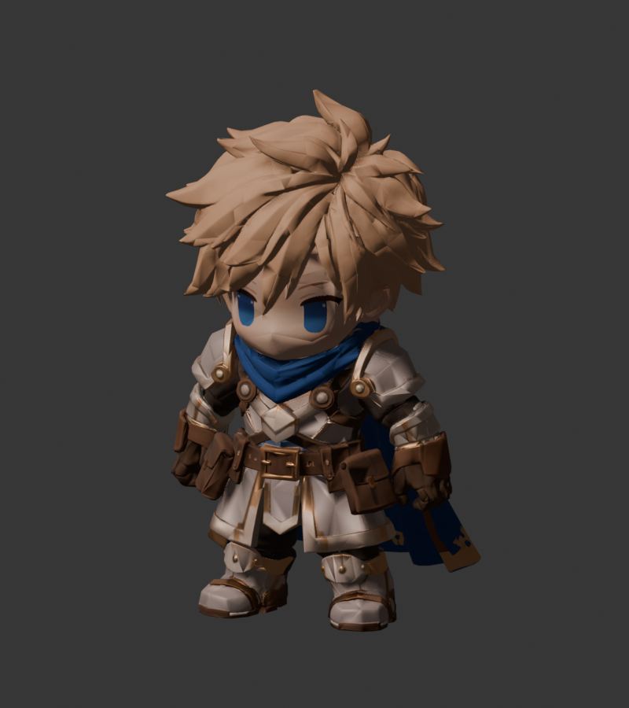
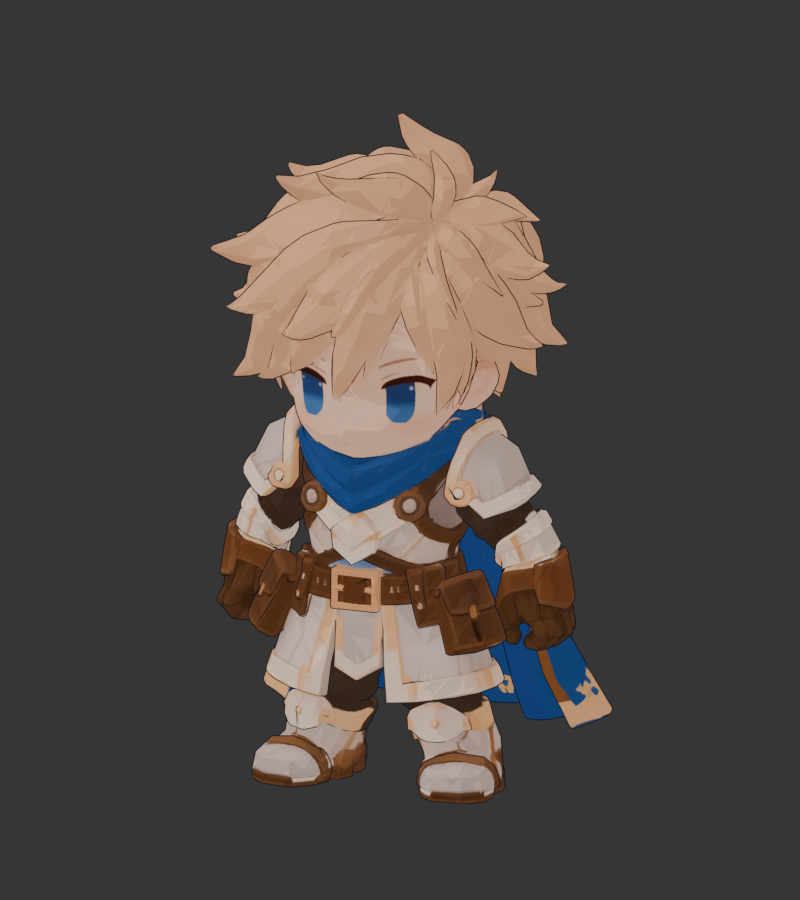
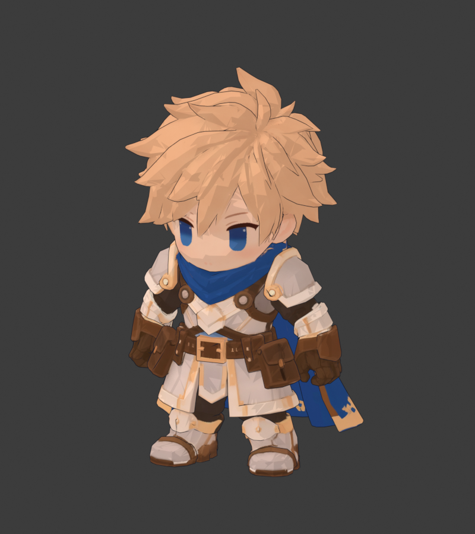
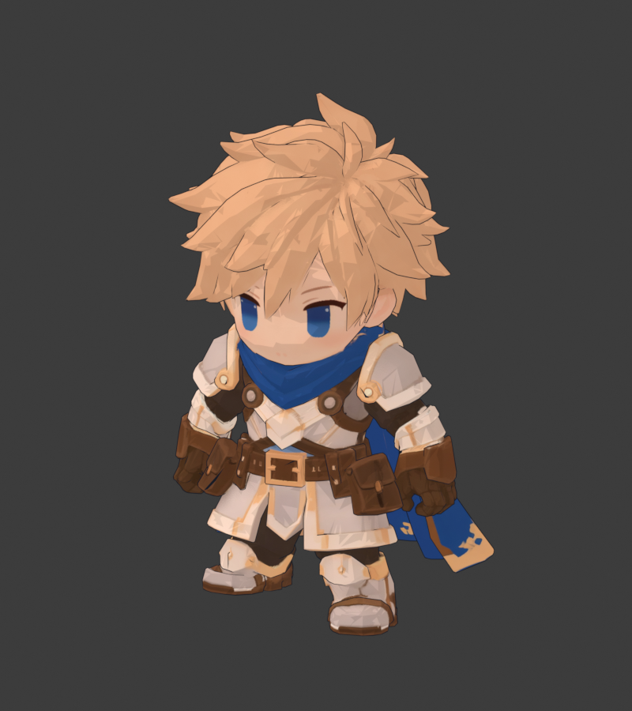
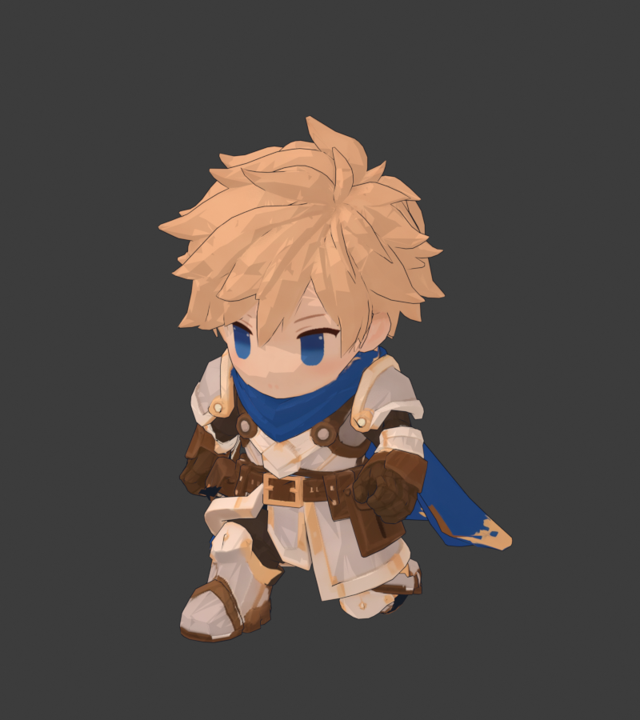
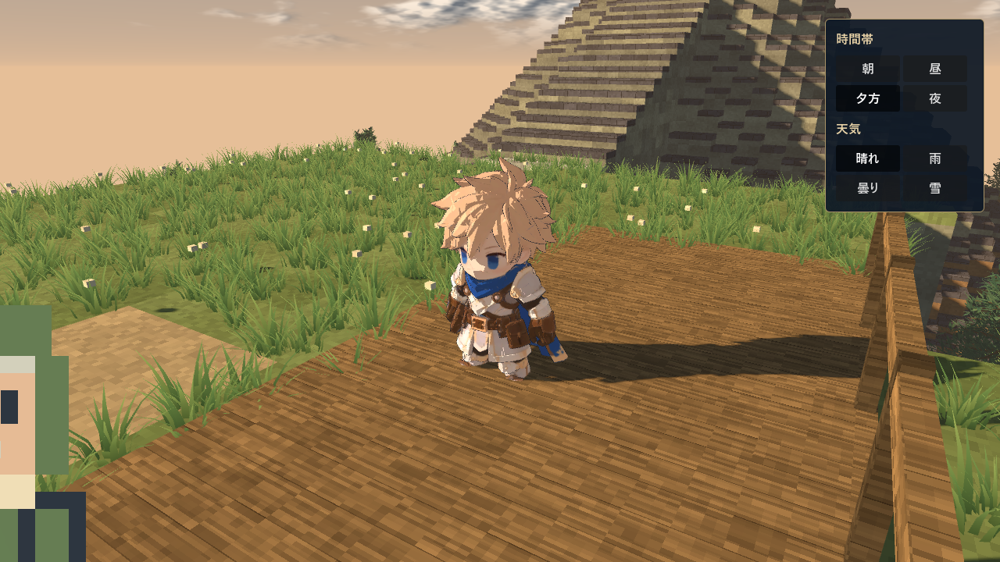

# Hero2 セルルック確認

Blender MCP / Blender 5.1.2で作業。元データは以下に保存しています。

- `hero2_before_toon.blend` / `hero2_before_toon.glb`: 作業前のディスク上のファイル。
- `hero2_live_before_toon.blend`: 作業開始時のBlender内の状態。Toon再生成用の入力。
- `../hero2_before_rig.blend`: リギング前のモデル。

## 見た目の比較

同じカメラとKey Lightで比較。色を保つためToonではStandardを採用しました。

|元のPBR / AgX|Toon / AgX|Toon / Standard（採用）|
|---|---|---|
||||

|歩行|走行|
|---|---|
|||

Godotのサンプル内での表示：

`preservation_before.json` と `preservation_after.json` で、元の頂点座標・
トポロジー・UV・全ウェイト・画像バイト列・idle/walk/runのキーが一致しています。
法線とマテリアルのみToon用の複製に変更し、元データはOriginalシーンに保持。
GLBに埋め込んだBase Colorも元画像と同じSHA-256です。

GLBはマットな互換マテリアルと別の輪郭メッシュを持ち、Godotでは
`hero2_import.gd` が3段階シェーダーを復元します。EeveeノードグラフはGLBに
保存されないため、GLBだけを他のエンジンへ移す場合はセルシェーダーが必要です。
