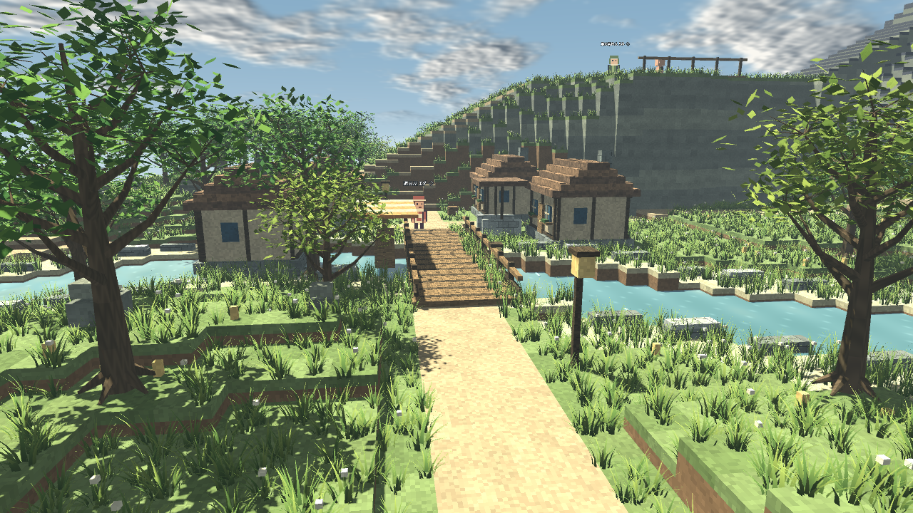
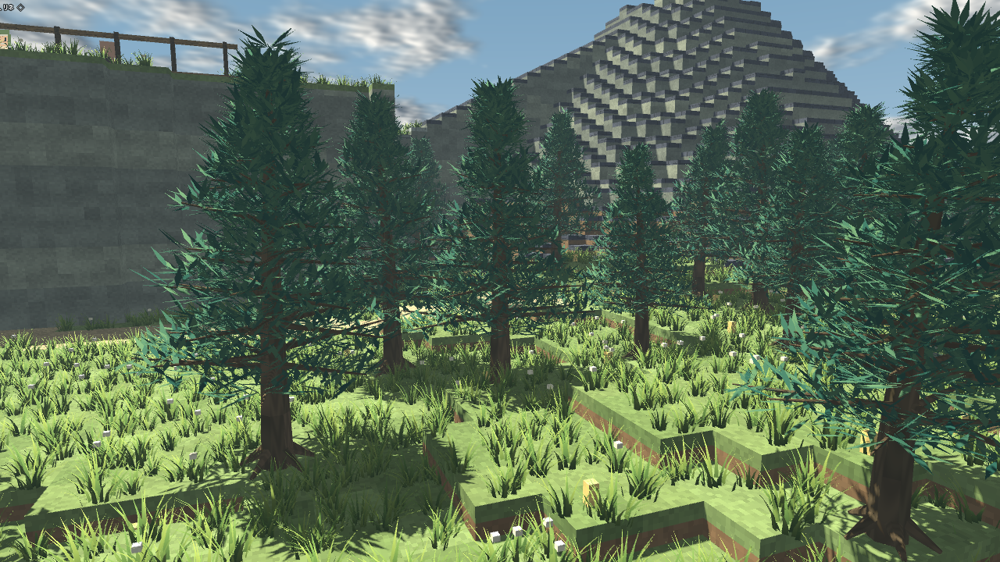

# JRPGWorldSample の自然な木・草

`samples/JRPGWorldSample.tscn` を実行すると新しい植生を生成する。
`4` キーの橋視点で、広葉樹と川沿いの草をまとめて確認できる。
北側の森には針葉樹を配置している。地形・建物は従来のボクセル表現。





## 植生の構成

- 広葉樹：先細りの幹、根張り、分岐する枝、折り目のある小さな葉。緑色・黄緑色を含む3バリエーション。
- 針葉樹：高さや長さの異なる枝、立体的に広がる青緑色の葉。3バリエーション。
- 草：根元から先端へ細くなる、曲がった葉の株。通常の草と水辺の背の高い草を各3バリエーション。
- 葉と草は風で揺れ、雨で濡れ色になり、雪が上面に乗る。戦闘中の樹冠の非表示・終了後の復帰にも対応。

外部画像やモデルへの依存はなく、3Dメッシュをシードから生成する。木の配置・サイズと幹の衝突判定は従来の配置処理を使う。
メッシュ・材質を共有し、バリエーションとチャンクごとにMultiMeshへまとめる。草の描画距離は85m、草自体の影は無効。

## 調整箇所

- `scripts/world_jrpg/natural_vegetation.gd`：`_tree()` の樹高・枝・葉・配色、`_grass()` の草丈・幅・株の葉数。
- `scripts/world_jrpg/natural_vegetation.gdshader`：揺れ幅・速度、濡れ色、積雪。
- `scripts/world_jrpg/natural_grass.gdshader`：草・水辺の草専用。光の方向や受ける影で色が変わらない `unshaded` 描画。株の配色・根元から先端の色の変化、風、雨・雪は維持する。変更後の画像は `assets/world_jrpg/preview_bridge_day_clear.png`。
- `scripts/world_jrpg/world.gd`：従来どおり木の密度と `_build_grass()` の草の配置範囲・密度を管理。
- `scripts/world_jrpg/voxel_prop.gd` / `voxel_batch.gd`：既存の木の配置呼び出しを新しい植生へ接続。

## 確認結果

Godot 4.6.1 / GL Compatibility / RTX 4050 Laptop / 1280×720で実描画を確認。
ウォームアップ45フレーム後の90フレームは橋・広葉樹・針葉樹の視点で約1,500ms（約60fps）、全景は約3,027ms（約30fps）。
全景は全域の木を描画するため負荷が高い。木の距離別LODは未実装。

`scripts/world_jrpg/verify_sample.gd` の移動・経路・会話・戦闘チェックに加え、新しい植生への16通りの時間帯／天候の反映、戦闘中の樹冠非表示と終了後の復帰を確認。
実行環境由来の証明書ストア・シェーダーキャッシュ保存エラーは出るが、スクリプト・シェーダーのコンパイルと画像出力は成功。

```powershell
godot --headless --path . --script scripts/world_jrpg/verify_sample.gd
godot --path . --resolution 1280x720 res://samples/JRPGWorldSample.tscn -- --sample-capture --view=bridge --time=day --weather=clear
```
