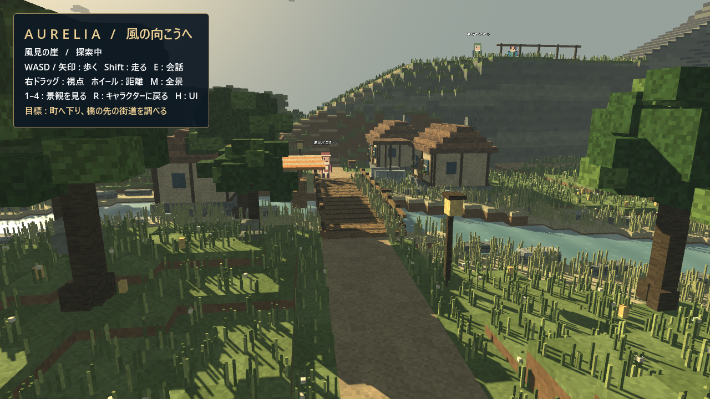
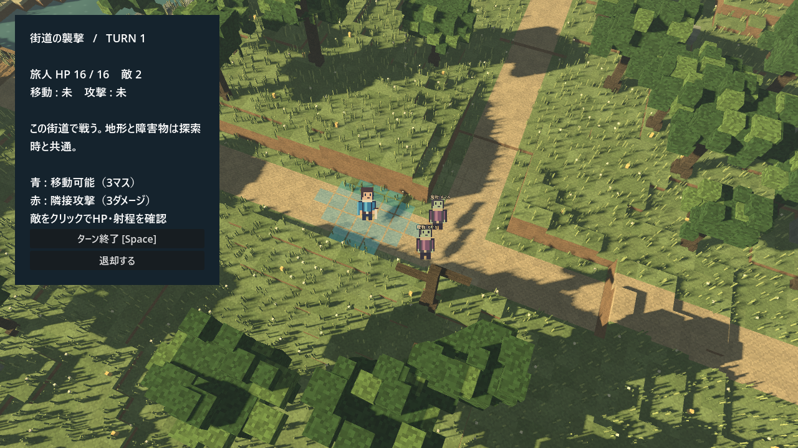

# Aurelia — JRPG探索マップの別シーンサンプル

Godot 4.6.1。`samples/JRPGWorldSample.tscn` を開いて **F6** で実行。
F5 は従来どおり既存のメインシーンを実行する。
`Main.tscn`、既存の戦闘システム、作業中の `OpenWorldSample` は変更していない。



400×400（160,000セル）の有限マップ。旧128×128に対して面積約9.77倍。
キャラクターと建物の大きさを保ち、東方の草原・大高原・南の森林・遠方の海岸へ拡張している。
風見の崖から始まり、南の坂道を下るとリーヴェの町、橋を渡ると街道の遭遇イベント。
東の街道は暁の城へ、北東は白銀の高地、崖から北西の登山道は火山の縁へつながる。
南の海岸には桟橋と船、灯台がある。建物内・遊泳・乗船は未実装。

| 操作 | 内容 |
|---|---|
| WASD / 矢印 | カメラ基準でキャラクターを移動 |
| Shift | 走る |
| E | 近くのNPCと会話 |
| E / Enter / Space | 会話を次へ |
| Esc | 会話を閉じる。遭遇の導入では読み飛ばして戦闘へ |
| 右ドラッグ / ホイール | カメラ回転 / ズーム |
| M | 全景と追従視点を切り替え |
| 1 / 2 / 3 / 4 | 全景 / 町 / 高地 / 橋の観察視点 |
| R | キャラクターの追従視点に戻る |
| H | 探索UIの表示切り替え |

観察視点から移動キーを押すと、キャラクターの位置に視点を戻して移動する。

### ゲームパッド

接続したパッドで操作できます。ボタン名はXbox表記です（PS系では A＝×、B＝○、Y＝△、LB/RB＝L1/R1、LT/RT＝L2/R2）。キーボード・マウスも引き続き使えます。

| 操作 | 探索中 | 戦闘中 |
|---|---|---|
| 左スティック | キャラクター移動（倒し具合で速度調整） | マス・メニュー選択 |
| 右スティック | カメラ回転・仰角 | カメラ平行移動 |
| A / B | 会話・次へ / 会話を閉じる | 決定・実行 / キャンセル |
| 左スティック押し込み（長押し） | 走る | — |
| 右スティック押し込み | 追従視点に戻す | 旅人へカメラを戻す |
| Y | 全景・追従切替 | 待機（向きを選んで決定） |
| LT / RT | 縮小 / 拡大 | 縮小 / 拡大 |
| LB / RB | 時間帯 / 天気を順に変更 | カメラを90度回転 |
| 十字キー | 上：全景、右：町、下：高地、左：橋 | マス・メニュー選択 |
| Back / Share | 探索UIの表示切替 | — |

戦闘では移動・攻撃・スキル・待機・退却をメニューから選べます。スティックの微小なずれは無視し、マス選択は長押しでリピートします。アナログ入力は最初に接続されたパッドを使用します。
自由移動は高さマップと障害物領域を使う。0.5段差は移動可能、水・溶岩・急崖・建物・木の幹を遮断。
低フレームレート時は移動を分割して判定する。物理剛体やNavMeshによる移動ではない。

## 会話とイベントの編集

`assets/world_jrpg/story.json` を変更してシーンを再実行する。
シーンルートの `story_path` を別JSONへ変更して差し替えることもできる。

- `npcs`: `id`、`name`、`position: [x, z]`、`palette`、`lines`（会話文の配列）。
- `encounter`: `id`、`position`、`radius`、`title`、`lines`、`victory`、`defeat`。
- 座標はマップの地面座標。NPCは有効な地面かつ建物の外に配置する。

遭遇は橋の東 `(87, 80)` にある金色のマーカーに近づくと発生する。
導入会話 → 小規模戦闘 → 結果会話 → 探索復帰まで実装済み。
勝利した遭遇は再発しない。勝利時は最後に移動した場所からそのまま探索を再開する。
敗北・退却では同じマップの遭遇開始位置で回復。マーカーから一度離れて戻ると再挑戦できる。
状態は実行中のみ保持し、セーブデータには書き込まない。

## 戦闘サンプル



探索していた地形に11×11の範囲を取り、通行可能な地面にだけ半透明のマスを表示する。
探索中の旅人ノードをそのまま使い、戦闘開始時の位置も維持する。別の盤面や地形は生成しない。
旅人1人と敵2体。青いマスをクリックして3マス以内を移動、隣接する敵をクリックして攻撃。
移動と攻撃は各ターン1回。Spaceまたはボタンで敵ターンへ進む。
敵は同じ地形の経路を探して2マスまで近づき、隣接時に攻撃する。全滅判定・撃破・HP・退却あり。
段差・水・崖・建物・木の幹の判定は探索と共通。橋の高さや地形の凹凸をマス選択にも反映する。
移動は経路に沿ったアニメーション。攻撃は通行可能な隣接マスに限定し、崖越しには攻撃できない。
戦闘中は周囲10mの樹冠を描画から除き、キャラクターの視認性を確保する。幹と当たり判定は維持する。
戦闘終了時にはマスと敵だけを取り除き、樹冠を元に戻す。

これは同一マップ上での探索と戦闘を試す簡易実装で、既存のAP・ジョブ・成長・保存には未接続。
本番のSRPGへ接続する際は `world.gd` の `_start_battle()` / `_finish_battle()` が差し替え箇所。

## 新アセットとキャラクター生成

- `scripts/world_jrpg/voxel_prop.gd`: 木・岩・家・塔の手続き生成。`@tool`付きで単体利用も可能。
- `voxel_batch.gd`: 色ごとにMultiMeshへまとめる描画補助。
- `surface.gdshader`: 草地、石積み、自然岩、木目、屋根、葉の微細な模様。遠景では細部を抑える。
- `water.gdshader`: 時間変化する波紋と視線角度に応じた水面の反射表現。
- `world.gd`: 地層のある崖、草原、雪山、火山、海と川、城、町、展望台、桟橋の組み立て。
- `assets/world_jrpg/palette.json`: 地形と建物の配色。
- `pixel_actor.gd`: オリジナル24×32ピクセルの4方向・3フレーム歩行キャラクター。

旅人・案内人・商人・衛兵・敵の5種。マントと剣、フード、エプロン、肩鎧などを描き分けている。
画像はコードから生成するため外部生成サービスは不要。
`pixel_actor.gd` の `PALETTES` と矩形の構成を変更すれば再生成できる。
将来のGUI生成ツールは未実装だが、PNGアトラスの書き出しツールは利用できる。

```powershell
godot --headless --path . --log-file ./jrpg-export.log --script tools/asset_gen/export_world_characters.gd
```

`assets/world_jrpg/*_atlas.png` に72×128の透過PNGを出力。
横3コマ、縦は手前・右・左・後ろの順。ゲームでは同じ生成関数から直接テクスチャを作成する。

## 検証

```powershell
godot --headless --path . --log-file ./jrpg-check.log --script scripts/world_jrpg/verify_sample.gd
godot --path . --log-file ./jrpg-render.log --resolution 1280x720 res://samples/JRPGWorldSample.tscn -- --sample-capture --view=overview
```

`godot` は実際のGodot実行ファイルに読み替える。
キャプチャの `--view` は `cliff` / `village` / `bridge` / `mountain` / `overview` / `dialog` / `battle`。
画像は `assets/world_jrpg/preview_<view>.png` に保存して終了する。

自動検証はスポーンから全NPC・主要地点・桟橋への到達、崖・海・家の遮断、会話、
遭遇の起動、移動制限、連続攻撃の禁止、敵AI、勝利・敗北、再遭遇の制御を確認する。
Godot 4.6.1で全項目PASS。同じキャラクターの再利用、位置の維持、勝敗後の復帰、
橋と崖での高さを考慮したマウス選択も検証済み。1280×720の崖・町・橋・戦闘の描画を確認。
検証環境ではOS証明書ストアとシェーダーキャッシュへのアクセス警告が出るが、シーンの実行・画像出力は完了。
サンプル自体はネットワークを使用しない。
既存のエディタープラグインには `godot_mcp` / `addons/godot_mcp` のクラス重複警告があり、今回の修正範囲には含めていない。

## 見た目と広域化

参考画像の暖かい斜光、長い影、草木の密度、水辺の木造建築を手続き生成で取り入れている。
雲のある空、距離による霞、細かな葉の集まり、町と川沿いの草・葦・花、護岸、橋の板・手すり、
街灯と木箱を追加。照明と材質は全域に適用し、細かな植生と小物は町・橋周辺に集中している。
水面はGL Compatibility用の簡易表現で、画面全体のレイトレーシングやSSRではない。

初期位置から到達可能な地面137,422セルを確認。
東端街道 `(370, 80)`、南の街道 `(210, 350)`、東の高原 `(305, 65)`、南東の森林 `(350, 300)` への経路を検証。
32×32単位の描画バッチ、材質・メッシュの共有、地形高さキャッシュ、チャンク別の障害物検索を使用。
細かな草の描画は100m以内。全地形は開始時に生成し、ストリーミング生成は未実装。

描画負荷の参考値：RTX 4050 Laptop、GL Compatibility、1280×720、橋の固定視点で、
ウォームアップ後の120フレームが2,000ms（60fps）、988ドローコール。
この固定視点・検証環境での測定であり、全景や他のGPUでのフレームレートは未計測。
